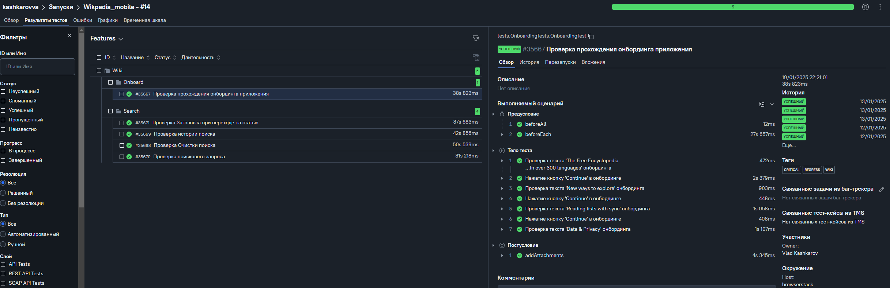

# Тесты приложения Wikipedia Mobile

## Содержание

* <a href="#tools">Инструменты</a>
* <a href="#cases">Тестовое покрытие</a>
* <a href="#launch">Запуск</a>
* <a href="#allure">Отчет в Allure</a>
* <a href="#allureTestOps">Интеграция с Allure TestOps</a>
* <a href="#telegramBot">Бот в Telegram</a>
* <a href="#video">Видео прохождения тестов</a>

---
<a id="tools"></a>

## <a name="Инструменты">**Инструменты**</a>

<p align="center">
<a href="https://www.jetbrains.com/idea/"></a>
<a href="https://www.jenkins.io/"></a>
<a href="https://github.com/"></a>  
<a href="https://www.java.com/"></a>
<a href="https://gradle.org/"></a>  
<a href="https://junit.org/junit5/"></a>
<a href="https://selenide.org/"></a>
<a href="https://rest-assured.io/">  </a>
<a href="https://github.com/allure-framework/"></a>
<a href="https://developer.android.com/studio">  </a> 
<a href="https://www.browserstack.com/">  </a>
<a href="https://appium.io/">  </a>
<a href="https://telegram.org/"></a>
<a href="https://www.vysor.io/"></a>
</p>

---

<a id="cases"></a>

## <a name="Тестовое покрытие">**Тестовое покрытие**</a>

### Онбординг

✅ Проверка прохождения онбординга приложения

### Поиск

✅ Проверка поискового запроса <br>
✅ Проверка Заголовка при переходе на статью <br>
✅ Проверка истории поиска <br>
✅ Проверка Очистки поиска<br>

<a id="localrun"></a>

<a id="launch"></a>

## <a name="Запуск">**Запуск**</a>

**Предварительная установка компонентов:**

✅**Установить [android studio](https://developer.android.com/studio)**

- Прописать настройки системных переменных:
  Параметры Path:
  Windows:

```  
  %ANDROID_HOME%\tools
  %ANDROID_HOME%\tools\bin
  %ANDROID_HOME%\platform-tools
```

> <b>В Android Studio -> SDK Manager</b> скачать 15 android <br>
> В <b>VDM</b> скачать образ <b>Pixel 9 Pro XL для 15 android</b> <br>
> <b>Запустить</b> эмулятор телефона (Pixel 9 Pro XL, android 15)

✅**Установить [node.js](https://nodejs.org/en/download)**

✅**Установить [Appium Server](https://github.com/appium/appium)**

```bash
npm install -g appium@latest
appium driver install --source=npm uiautomator2
```

**Запустить Appium Server**

```bash
appium server --base-path /wd/hub
```

**Для запуска следует открыть IntelliJ IDEA и выполнить в терминале:**

```bash
 gradle clean test -DdeviceHost=emulation
```

```
gradle clean test 
-DdeviceHost=emulator
```

> Для запуска c реальнного устройства <br>
> - Установить [Vysor](https://www.vysor.io/)<br>
> - Подключить устройство по PTP <br>
> ```bash
> gradle clean test -DdeviceHost=real
> ```


<a id="allure"></a>

## <a name="Отчет в Allure">**Отчет в Allure**</a>

После выполнения тестов можно посмотреть отчет в [Allure](https://jenkins.autotests.cloud/job/Wikpedia_mobile/12/allure/)

### На скриншоте один из результатов выполнения тестов:


---

<a id="allureTestOps"></a>

## <a name="Интеграция с Allure TestOps">**Интеграция с Allure TestOps**</a>

Есть интеграция с [Allure TestOps](https://allure.autotests.cloud/project/4553/dashboards), где можно посмотреть еще
ручные тесты



---

<a id="telegramBot"></a>

## <a name="Бот в Telegram">**Бот в Telegram**</a>

После выполнения отчета результат так же предоставит бот в Telegram:
<p align="center">
    
</p>

---

<a id="video"></a>
## <a name="Видео прохождения тестов">**Видео прохождения тестов**</a>
<p align="center">
   
</p>
